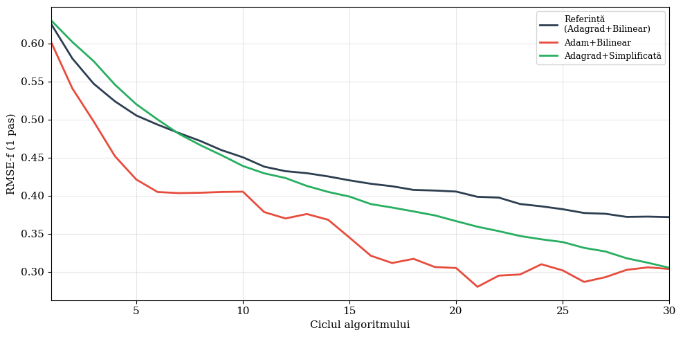
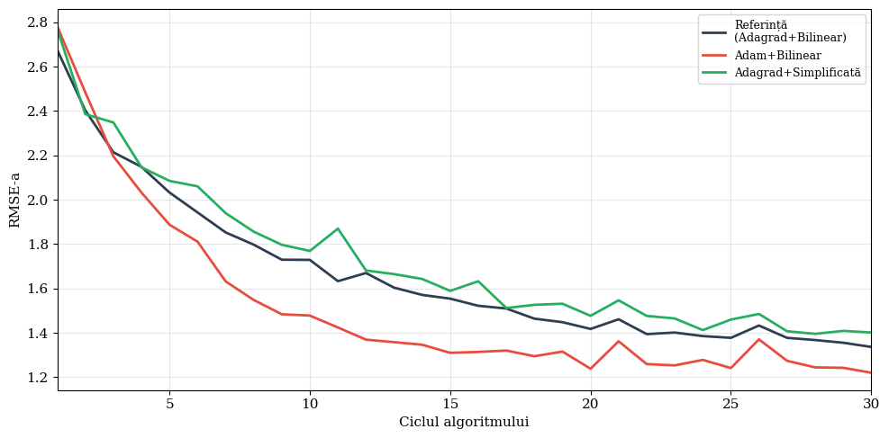
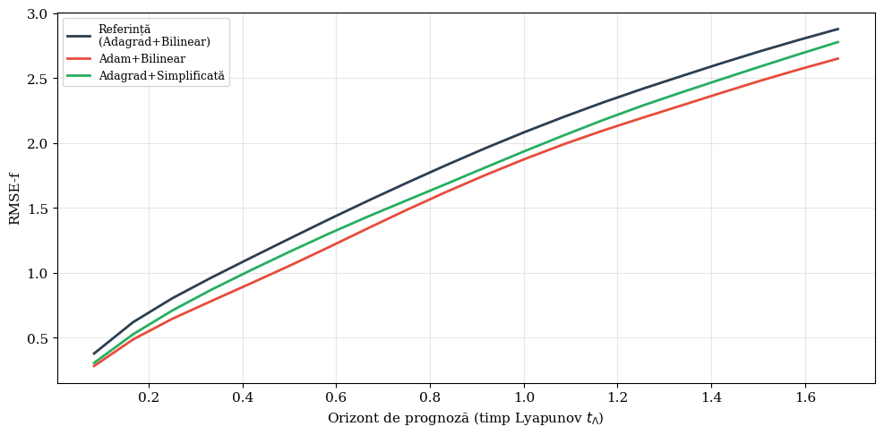
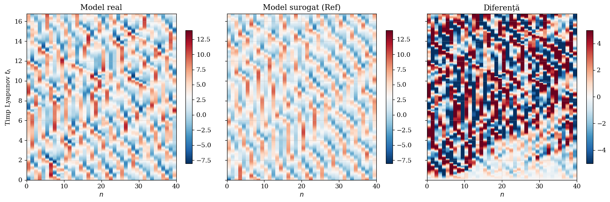
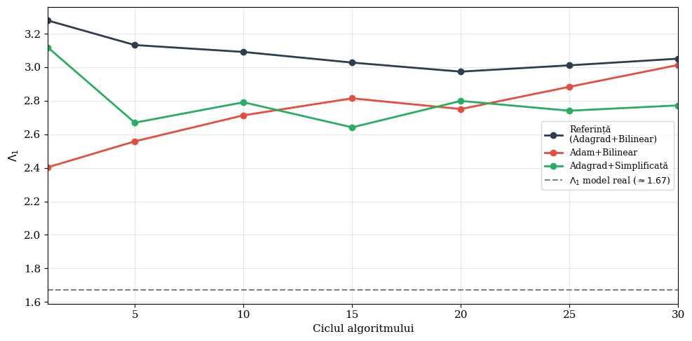

# Hybrid DA-ML Algorithm for Emulating the Lorenz 96 Model

**Bachelor's Thesis — Nikolas Gavaz-Nicolae**  
Babeș-Bolyai University, Faculty of Mathematics and Computer Science  
Supervisor: Lect. Dr. Oana Lang | 2026

---

## Overview

This repository contains the implementation and experiments for combining **data assimilation (DA)** with **machine learning (ML)** to build a surrogate model of the chaotic Lorenz 96 system from sparse and noisy observations, following the hybrid iterative algorithm proposed by [Brajard et al. (2020)](https://doi.org/10.1016/j.jocs.2020.101171).

The surrogate model is a **residual convolutional neural network** that learns the system's dynamics without access to the governing equations — only from analysis fields produced by an Ensemble Kalman Filter.

**Key result:** Adam optimizer reduces 1-step forecast RMSE by 25% versus the Adagrad reference. All hybrid configurations outperform cubic interpolation on the same sparse observation setup.

## Why this matters

Many real-world systems — weather, ocean dynamics, chemical processes — are chaotic and only partially observable. Traditional numerical models require the governing equations to be known in advance, but for many systems these equations are incomplete or unavailable. This work explores whether a neural network, guided by data assimilation, can learn the dynamics of a chaotic system directly from sparse, noisy observations — bypassing the need for explicit model equations.

## Method

At each iteration of the DA-ML cycle:

1. **DA step**: The Ensemble Kalman Filter (EnKF-N) is run with the current surrogate model, producing spatially complete analysis fields and covariance estimates.
2. **ML step**: The neural network is trained on the analysis fields, using the covariance matrix to weight the loss function.

The two steps reinforce each other: a better surrogate produces better analyses, and better analyses provide higher-quality training data.

## Experiments

Three configurations are compared, varying one component at a time:

| Configuration | Optimizer | Architecture | Parameters | RMSE-f (1 step) | RMSE-a | Λ₁ |
|---|---|---|---|---|---|---|
| **Reference** | Adagrad | Bilinear (4 layers) | 9,389 | 0.379 | 1.336 | 3.01 |
| **Experiment 1** | Adam | Bilinear (4 layers) | 9,389 | 0.283 | 1.220 | 2.73 |
| **Experiment 2** | Adagrad | Simplified (no bilinear) | 9,245 | 0.307 | 1.401 | 2.74 |

**Key findings:**
- Adam reduces RMSE-f by **25%** compared to Adagrad and converges twice as fast
- The bilinear layer does not provide a clear advantage on the reduced dataset (K=4,000)
- All configurations outperform cubic interpolation (RMSE-a: 1.2–1.4 vs. 2.44)

## Results

Figure axis labels are in the original Romanian. Captions below each figure summarize the content in English.

**Convergence of forecast error.** Adam converges to lower RMSE-f roughly twice as fast as Adagrad across the 30 DA-ML cycles. Axis labels in Romanian: ciclu = cycle.



**Convergence of analysis error.** All hybrid configurations achieve analysis RMSE in the 1.22–1.40 range, substantially below the cubic interpolation baseline (2.44).



**Forecast skill vs. lead time.** RMSE-f as a function of forecast horizon. Error growth reflects the chaotic nature of the system. Axis labels in Romanian: orizontul de prognoză = forecast horizon.



**Hovmøller diagram: true model vs. surrogate.** The trained surrogate reproduces the propagation patterns of the true Lorenz 96 dynamics. Left: true model; centre: surrogate; right: difference.



**Lyapunov exponent estimation.** All configurations converge to Λ₁ ≈ 2.7–3.0. The true model reference is 1.67. The gap reflects the reduced dataset size (K=4,000) used to keep runtimes tractable. Brajard et al. use K=40,000.



## Setup

| Parameter | Value |
|---|---|
| State variables (m) | 40 |
| Forcing (F) | 8 |
| Time step (h) | 0.05 |
| Observations per step (p) | 20 (50%) |
| Observation noise (σ_obs) | 1.0 |
| Ensemble size (N) | 30 |
| Model noise (σ_m) | 0.1 |
| DA-ML cycles | 30 |
| Epochs per cycle | 20 |
| Batch size | 256 |
| Dataset length (K) | 4,000 |

## Running

The notebook is designed to run on [Google Colab](https://colab.research.google.com/) with GPU acceleration.

1. Open `da_ml_lorenz96_experiments.ipynb` in Google Colab
2. Set runtime to GPU (Runtime → Change runtime type → GPU)
3. Run all cells (Runtime → Run all)

Total runtime: ~3.3 hours on NVIDIA A100 for all 3 experiments.

## Dependencies

- Python 3.x
- PyTorch
- NumPy
- SciPy
- Matplotlib

All dependencies are available by default in Google Colab.

## Repository Structure

```
da-ml-lorenz96/
├── da_ml_lorenz96_experiments.ipynb   # Full implementation and experiments
└── README.md
```

## Reference

Brajard, J., Carrassi, A., Bocquet, M., Bertino, L.: *Combining data assimilation and machine learning to emulate a dynamical model from sparse and noisy observations: A case study with the Lorenz 96 model.* Journal of Computational Science, 44, 101171, 2020.
